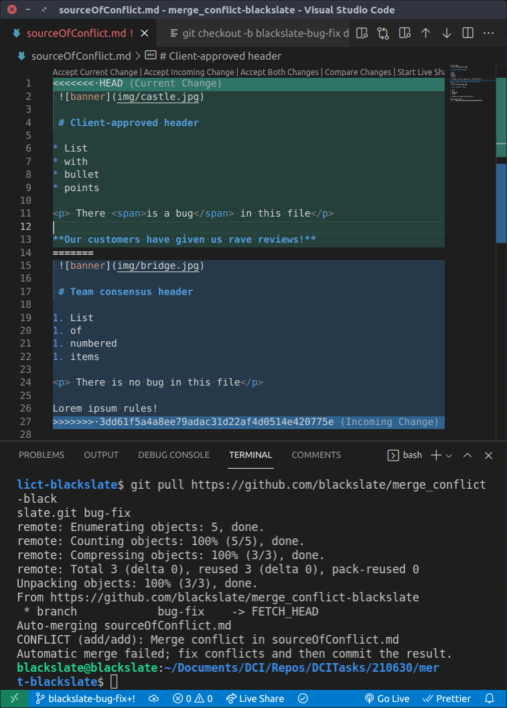

# Handling a Git Merge Conflict

In this exercise, you and a partner will make different changes to the same MarkDown document. This will generate a Merge Conflict, which you must then resolve.

## Instructions

### Working as an owner
1. Choose a partner
2. Give your partner a link to this GitHub repository
3. Clone your repository to your development machine. (Choose carefully which folder you use to hold your local repository.)
4. You will be the owner of your own repository.
5. Imagine that you have spoken with the client, and that you are acting with autority.
6. `cd` into your cloned repository
7. Open the repository folder in VS Code
8. Checkout the `dev` branch
9. Hide the bug by removing the style from the span, so that it no longer appears red.
10. Make some changes to your local repository. For example:
   * Choose a different banner image
   * Change the header
   * Change the list from a bulleted list to a numbered list
   * Add a paragraph of text
11. Run `git status` to see which files have changed
12. Run `git diff` to see which files have been edited
13. Use `git add .` to add your changes to git's staging area
14. Use `git commit` to commit your changes
15. In the commit message:
   * Create a short descriptive title
   * Provide details of all the changes that you have made
12. Checkout the `main` branch.
13. Merge the changes from the `dev` branch

### Working as a team member
1. Fork the repository for which your partners sent you a link
2. Clone your fork to your development machine. **Choose carefully which folder you use to hold your local repository. Do NOT put it inside the same folder as the repository for which you are the owner.**
3. Use `git remote -v` to check that an `upstream` remote for your repository exists.
4. If not, use `git remote add upstream <source>` where `source` will be the Code link from the URL your partner sent you.
5. Imagine that you have spoken with the dev team, and that you have to make an important bug fix, and also make some minor changes.
6. Create a new branch with a name that describes the feature that you are planning to work on.
7. As above, make some changes to your local fork. For example:
   * Fix the bug
   * Choose a different banner image
   * Change the header
   * Change the list from a bulleted list to a numbered list
   * Add a paragraph of text
8. Use `git add .` to add your changes to git's staging area
9. Use `git commit` to commit your changes
10. In the commit message:
   * Create a short descriptive title
   * Provide details of all the changes that you have made
11. Push your changes to your fork:
   `git push origin <name-of-your-feature-branch>`
11. Go to your GitHub fork and click on the Compare & Pull Request button that should have appeared.
12. Check that the automatically created message is meaningful, and if not, edit it.
13. Click on Create Pull Request.

### Working as the owner
When you receive notification of the PR created by your team member:
1. Visit your (authoritative) repository on GitHub
2. Click on the Pull Request tab
3. **Do not automatically merge the PR. Do NOT click on the green Merge Pull Request button**. Instead, click on the link to view `command line instructions` and copy the lines of code for Step 1. These allow you to pull the proposed changes to your development machine.
4. **Note that the code creates a new branch based on `main`. Change this so that it makes a branch based on `dev`.**
5. Pull the changes from your team member's feature branch.
6. Make sure that you are working in the branch created by your team member
7. Work through the Merge Conflict procedure. Remember: you are the owner. You have responsibility to the client. Choose which incoming changes to keep and which to reject.

8. When you are satisfied, commit the changes. You will see an automatically generated message. Why is it red? Why should you not use this?
9. In the commit message:
   * Create a short descriptive title
   * Provide details of all the changes that you have made
10. Hold a meeting with your team member, to reach consensus on what should be merged to the `dev` branch.
11. Checkout the `dev` branch
12. Merge the changes from the feature branch.
    `git merge --no-ff <team-members-feature-branch>`
13. Push the updated `dev` branch to your GitHub repository
    `git push origin dev`
14. Ask your team member to pull the changes from the `dev` branch.

### Working as team member
When you receive notification from the owner that the `dev` branch has been updated:
1. Checkout the `dev` branch
2. Run `git pull upstream dev`
3. Check that everything looks the way you expected after your discussions with the owner. If not, go through this cycle again.

### Working as the owner
When you receive notification from your team member that the `dev` branch is now operational:
1. Checkout the `main` branch
2. Merge the changes from the `dev` branch.
3. Push the updated `main` branch to your GitHub repository
4. Tell your team member that the changes have gone live.
